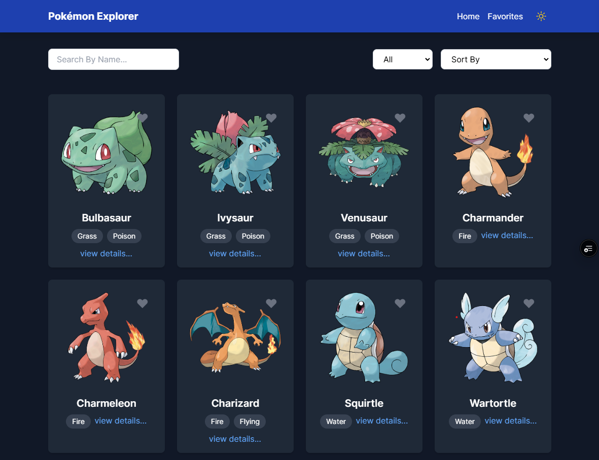
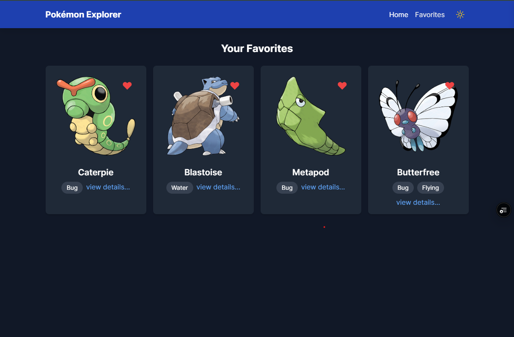
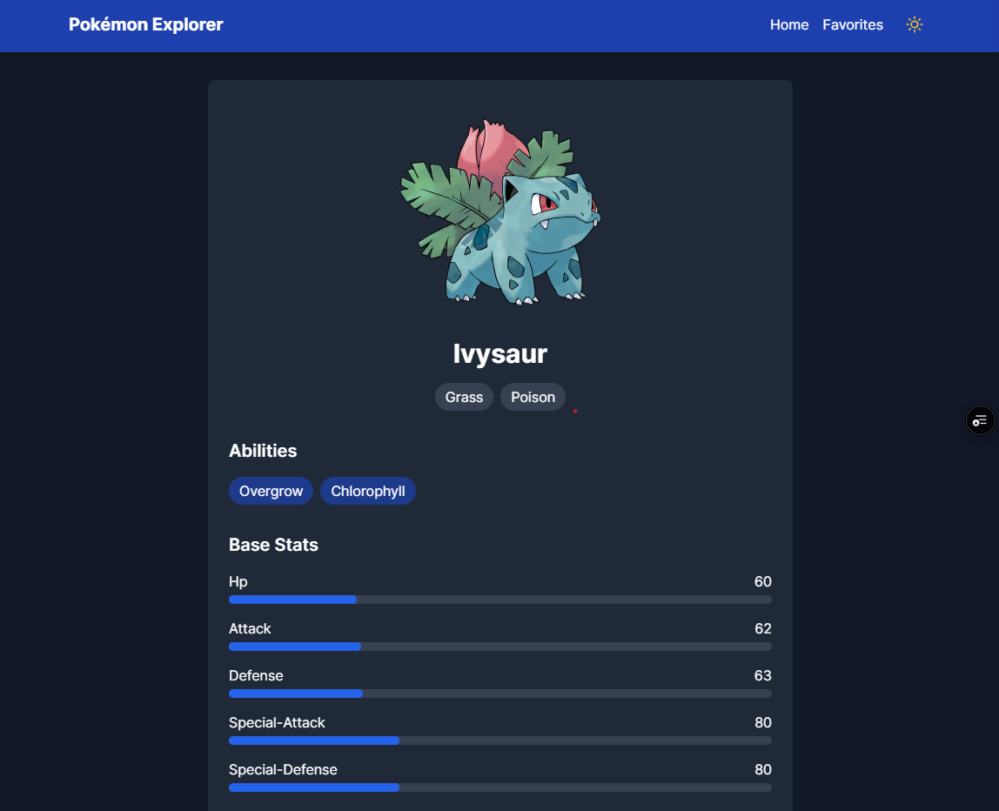

# Pokémon Explorer App

A dynamic React application to explore Pokémon with features like browsing, searching, and viewing detailed information. The app integrates with the PokéAPI and uses React Router for navigation.

## Features

-   **Homepage**: List of Pokémon with images and a "View Details" button.
-   **Details Page**: Dynamic route (`/pokemon/:name`) displaying Pokémon details.
-   **Search**: Filter Pokémon by name on the homepage.
-   **Favorites**: Save favorite Pokémon and view them on a separate page (`/favorites`).
-   **Navigation**: Links to Homepage and Favorites.
-   **Styling**: Designed with Tailwind CSS, Bootstrap, or Material-UI.

## API

-   **Base URL**: [https://pokeapi.co/api/v2/](https://pokeapi.co/api/v2/)
-   **Endpoints**:
    -   List Pokémon: `/pokemon?limit=50`
    -   Pokémon Details: `/pokemon/{name}`

## Technical Stack

-   React, React Router, Tailwind CSS.

## Installation

1. Clone the repository.
2. Install dependencies with `npm install`.
3. Start the server using `npm run dev`.
4. Visit `http://localhost:5173`.

## Screenshoot

## License

Licensed under the MIT License.

---
